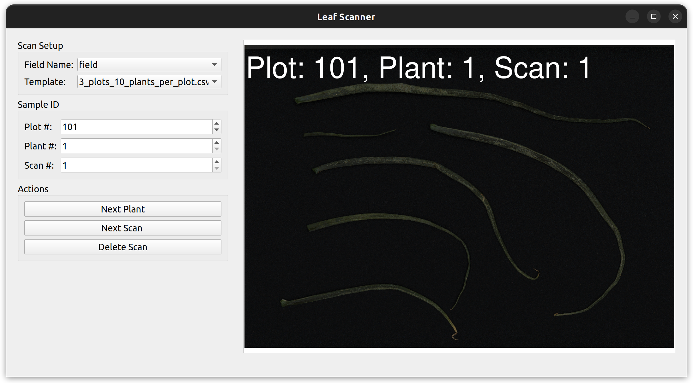
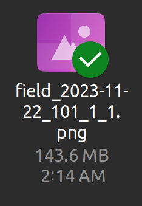
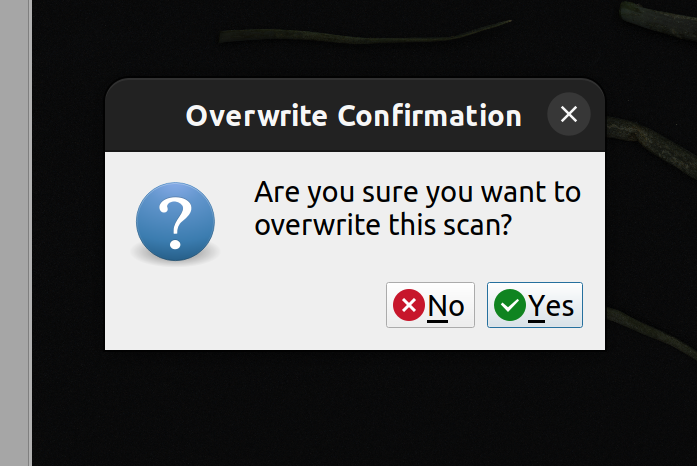
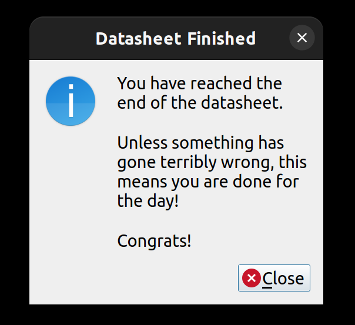

# LeafScanner

LeafScanner assists with flatbed scanning of leaves from agricultural field trials by 
automatically detecting when a new scan has been saved by the scanner and
renames and saves the scan file according to field, date, plot, plant, and scan number.

Warning! This software was originally created to work with scans from the Plustek Opticpro A320E scanner 
and may need some modifications to work with scans from other scanners. Please do not use this software
without performing a trial run with your own scanner and sample data.



The scan in the above image will be saved with this file name:



# Typical Workflow

1. Create a template csv file with the number of rows corresponding to the number of 
plants to be scannerd. This file should have the column names 'plot' and 'plant', 
and entries with integers as the plot and plant ids. An example
is [leafscanner/templates/3_plots_10_plants_per_plot.csv](leafscanner/templates/3_plots_10_plants_per_plot.csv)
2. Add a field name to [leafscanner/fields.csv](leafscanner/fields.csv). The default field name is 'field'.
3. Configure the scanner to save new images to [leafscanner/scan_dir](leafscanner/scan_dir)
4. Run `leafscanner.py`
5. Select the field and template you are using from the combo boxes on the left side of the screen
6. Start scanning! 

# Tips and tricks

- When a scan appears on the screen, click 'Next Plant' to advance to the next plant. If you have multiple scans per 
plant, you can click the 'Next Scan' button.
- In the template `3_plots_10_plants_per_plot.csv`, after you have reached the 10th plant in the plot, the 'Next Plant'
button will advance you to the first plant of the next plot.
- If a new scanned image is detected while the existing plot, plant, and scan # is associated with an existing image,
you will be asked if you want to overwrite the existing image. If you click 'No', the new scan will be discarded
and the original image will be retained.



- When you have reached the end of the template you will get this message. It may or may not be true depending on
your particular situation ;).



# Installation

In a terminal, clone the repository, or download the zip file at 
[https://github.com/wmpeebles/LeafScanner/archive/refs/heads/main.zip](https://github.com/wmpeebles/LeafScanner/archive/refs/heads/main.zip):

```bash
~$ git clone https://github.com/wmpeebles/LeafScanner.git
```

I recommend using a virtual environment and setting this up at `LeafScanner/venv/`

```bash
~$ cd LeafScanner/
~/LeafScanner$ python3 -m venv venv/
```
Activate the virtual environment

```bash
~/LeafScanner$ source venv/bin/activate
```

Install the required dependencies

```bash
(venv) ~/LeafScanner$ pip install -r requirements.txt
```

# Usage

Open a terminal in the `LeafScanner/` directory, activate the virtual environment, and run leafscanner.py

```bash
~/LeafScanner$ source venv/bin/activate
(venv) ~/LeafScanner$ cd leafscanner/
(venv) ~/LeafScanner/leafscanner$ python leafscanner.py
```

# Updating the UI Files

- [leafscanner/ui/main_window.ui](leafscanner/ui/main_window.ui) was created with QT Designer version 5.5.13
- [leafscanner/ui/main_window.py](leafscanner/ui/main_window.py) was created with pyuic5 using the command```pyuic5 -x main_window.ui -o main_window.py```